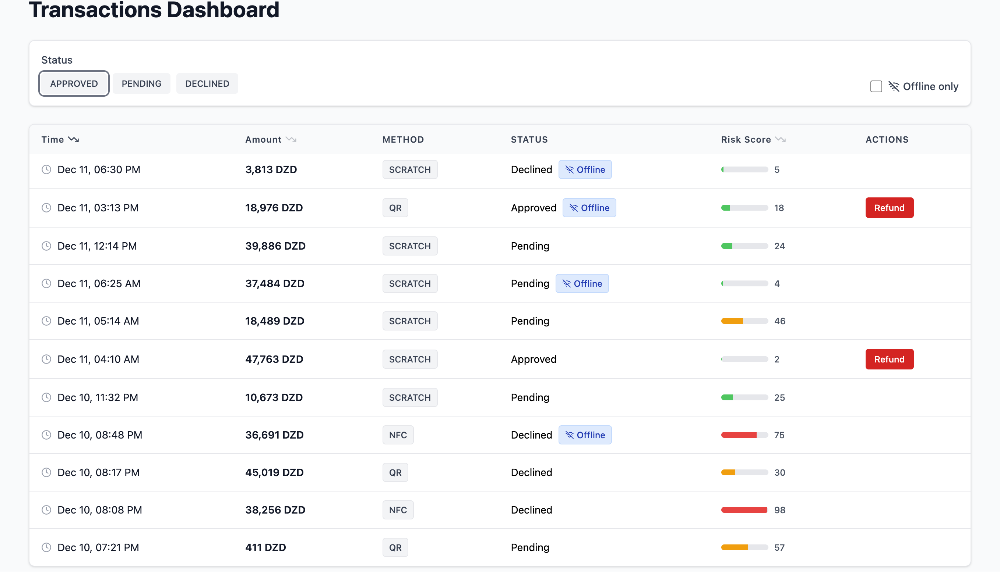

# Transactions Dashboard

## Tech Stack

- **React 18**
- **TypeScript** (strict typing)
- **TailwindCSS** (utility-first styling)
- No backend, no routing, no authentication

---

## Features Implemented

### Transactions List

- Displays a list of transactions with:

  - Time
  - Amount (DZD)
  - Payment method
  - Status
  - Risk score
  - Offline badge (when applicable)

- Clean and readable table layout

- Responsive design

### Filtering & Sorting

- Filter by **status** (multi-select)
- Filter **offline transactions only**
- Sorting by:

  - Time (default: descending)
  - Amount
  - Risk score

Filtering and sorting are computed via memoised selectors to avoid unnecessary re-renders.

---

### Refund Action (Optimistic UI)

- Refund button visible **only for APPROVED transactions**
- Clicking refund:

  1. Opens a confirmation modal
  2. Applies an **optimistic UI update**
  3. Simulates an API call using `setTimeout`
  4. Introduces a **20% failure rate**

---

## Performance Considerations

- `useMemo` used for filtered & sorted transaction lists
- `useCallback` used for stable handlers
- Row components are memoised to avoid unnecessary re-renders
- No virtualization added intentionally (out of scope for this task)

---

## Project Structure

```
src/
 ├─ components/
 │   ├─ Table.tsx
 │   ├─ Badge.tsx
 │   ├─ Button.tsx
 │   ├─ RefundModal.tsx
 │   └─ Modal.tsx
 |   └─ Notification.tsx
 |   └─ RiskScore.tsx
 |   └─ RefundModal.tsx
 |   └─ StatusBadge.tsx
 |   └─ TransactionsDashboard.tsx
 │
 ├─ types/
 │   └─ transaction.ts
 └─ App.tsx
```

Logic is intentionally separated from UI to keep components simple and testable.

---

## Running the Project

```bash
npm install
npm run dev
```

The app runs locally with mocked data and no external dependencies.

---

## Notes

- This solution intentionally prioritises **clarity, robustness, and scalability** over visual polish.
- Not all edge cases are implemented due to time constraints.

---

## Screenshot


